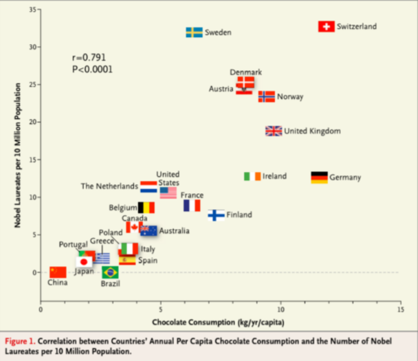

```{r setup, include=FALSE}
knitr::opts_chunk$set(echo = F)
library(knitr)
```

For each of the scenarios below, suggest a plausible omitted variable that could undermine the proposed causal relationship:

1. Increased chocolate consumption raises the number of nobel prizes

```{r, out.width="400px", fig.cap="", fig.align="center"}

```

2. Right-wing governments cause an increase in racist incidents

3. Living in Arkansas makes you more likely to vote for Trump

4. Famine causes violence

5. Large natural resource revenues cause authoritarianism

For each of the scenarios below, is reverse causation a risk?

6. Democracy causes development

7. British colonialism causes an independent judiciary today

8. Fast economic growth causes re-election of the government

9. Globalisation causes generous welfare states

10. Ethnic diversity in a neighbourhood causes violence

For each of the scenarios below, explain the risk of self-selection bias:

11. Working for an electoral campaign increases your income

12. Mountainous regions are more likely to encourage the formation of rebel groups

13. Candidates with a dedicated campaign headquarters are more likely to be elected

14. Political parties with a formal organizational structure are more likely to survive for more than 20 years

15. People with colourful clothes are more likely to attend political protests