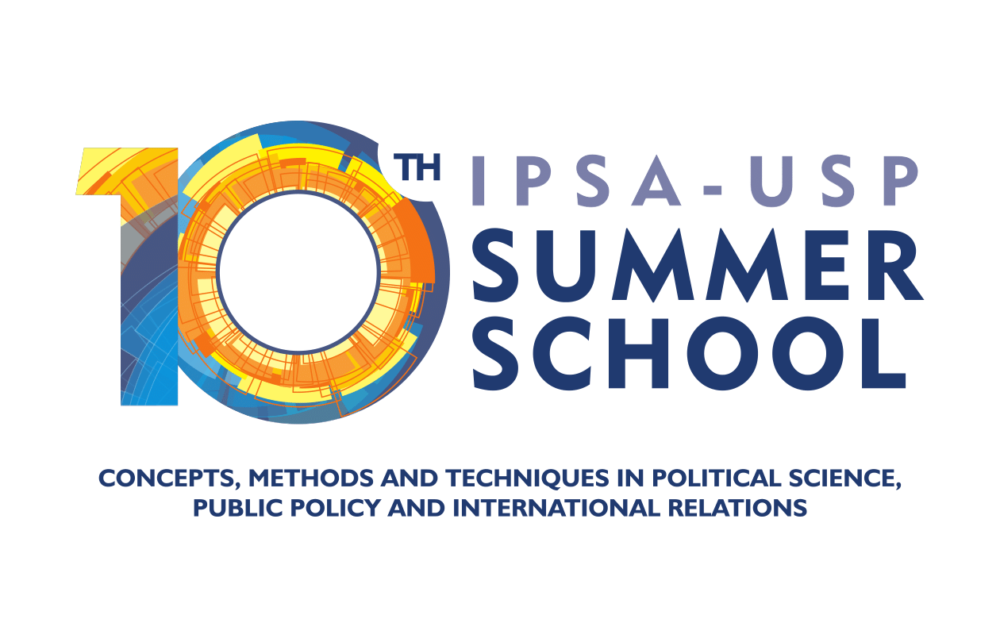

<style>
.column-left{
  float: left;
  width: 50%;
  text-align: left;
}
.column-right{
  float: right;
  width: 50%;
  text-align: right;
}
</style>

```{r setup, include=FALSE}
knitr::opts_chunk$set(echo = F)
library(knitr)
```

<div class="column-left">
This course provides students with the guidance and tools to become effective and constructive critics of political science research. 

Does development cause democracy? Do proportional representation systems generate more parties? We practice making forceful critiques of the theory, methods and evidence on both sides of these arguments, helping us understand the major findings in political science and how much we should trust them.

Participants will gain confidence in contributing to seminars, conferences and as referees, and will also gain new perspectives on how to design and execute their own research.
</div>


<div class="column-right">
```{r, fig.width=4}

```
</div>


